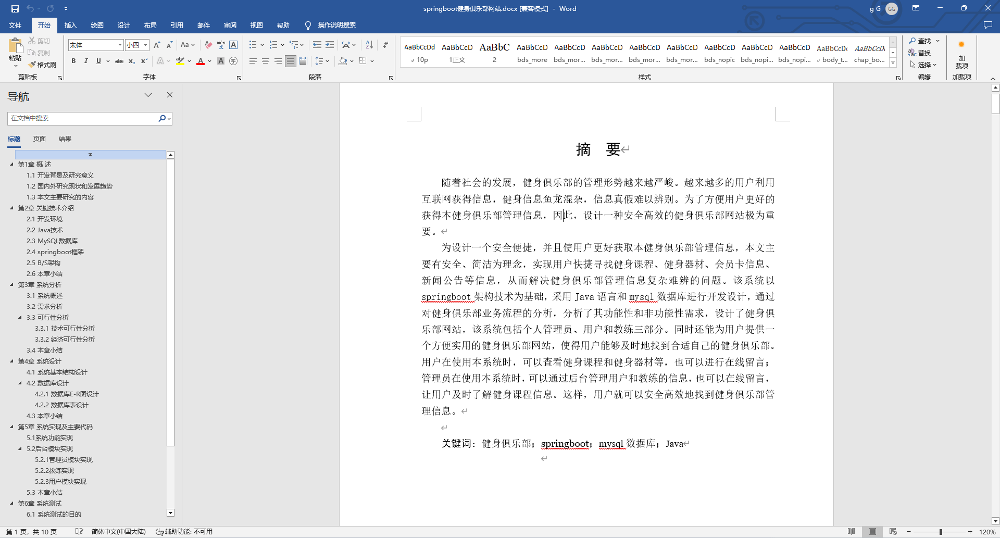
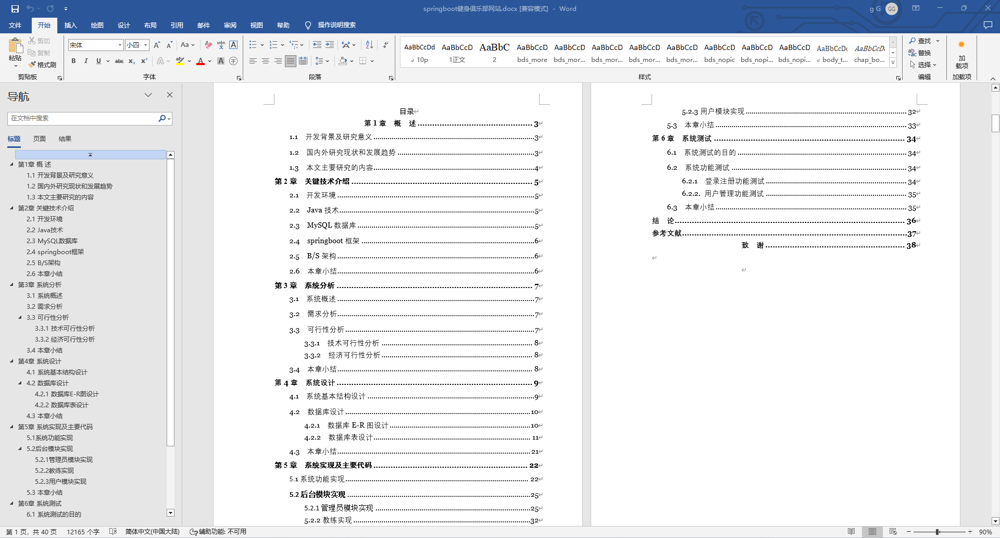

基于Springboot的健身俱乐部网站（程序+论文）
=
### 完整代码获取地址：从戎源码网 ([https://armycodes.com/](https://armycodes.com/))
### 作者微信：19941326836  QQ：952045282 
### 承接计算机毕业设计、Java毕业设计、Python毕业设计、深度学习、机器学习
### 选题+开题报告+任务书+程序定制+安装调试+论文+答辩ppt 一条龙服务
### 所有选题地址https://github.com/nature924/allProject

一、项目介绍
---
基于Spring Boot框架实现的健身俱乐部网站，系统包含三种角色：管理员、学员,教练主要功能如下。

### 【学员功能】

1. **首页：** 浏览健身俱乐部的最新信息。
2. **健身课程：** 查看健身课程的时间表和详情，进行预约。
3. **健身器材：** 浏览俱乐部提供的健身器材信息。
4. **会员卡信息：** 查看个人会员卡的信息和权益。
5. **新闻公告：** 获取俱乐部的最新新闻和公告。
6. **在线留言：** 在留言板上留言或查看其他学员的留言。
7. **后台管理：**
   - **首页：** 查看概况。
   - **个人中心：** 管理个人信息，包括修改密码。
   - **课程预约管理：** 查看和管理个人的课程预约。
   - **器材借用管理：** 查看和管理个人的器材借用情况。
   - **办卡信息管理：** 查看和管理个人的办卡信息。
   - **训练计划管理：** 查看和管理个人的训练计划。

8. **个人中心：** 管理个人信息，包括修改密码和查看个人的健身记录。

### 【管理员功能】

1. **首页：** 查看整体系统的概况和关键数据。
2. **个人中心：** 修改密码和管理个人信息。
3. **用户管理：** 管理学员的账号信息，包括审核注册。
4. **教练管理：** 管理教练的信息。
5. **健身课程管理：** 管理健身课程。
6. **课程预约管理：** 查看和处理学员的课程预约申请。
7. **健身器材管理：** 管理健身器材的信息。
8. **器材借用管理：** 查看和管理学员的器材借用情况。
9. **会员卡信息管理：** 查看和管理学员的会员卡信息。
10. **办卡信息管理：** 查看和管理学员的办卡信息。
11. **训练计划管理：** 查看和管理学员的训练计划。
12. **教室信息管理：** 管理健身课程的教室信息。
13. **在线留言：** 查看和管理学员的留言。
14. **系统管理：**
    - **关于我们：** 编辑俱乐部的介绍信息。
    - **系统简介：** 提供对系统的简要说明。
    - **轮播图管理：** 管理网站首页的轮播图。
    - **新闻公告：** 发布和管理俱乐部的新闻和公告。

### 【教练功能】

1. **首页：** 查看健身房信息。
2. **健身课程：** 查看和管理自己负责的健身课程。
3. **健身器材：** 查看和管理使用的健身器材。
4. **会员卡信息：** 查看和管理学员的会员卡信息。
5. **新闻公告：** 查看最新的俱乐部新闻和公告。
6. **在线留言：** 参与留言板。
7. **后台管理：**
   - **首页：** 查看概况。
   - **个人中心：** 管理个人信息，包括修改密码。
   - **课程预约管理：** 查看和管理学员对课程的预约。
   - **训练计划管理：** 查看和管理学员的训练计划。

8. **个人中心：** 管理个人信息，

二、项目技术
---
- 编程语言：Java
- 数据库：MySQL
- 项目管理工具：Maven
- 前端技术：VUE、HTML、Jquery、Bootstrap
- 后端技术：Spring、SpringMVC、MyBatis

三、运行环境
---
- 操作系统：Windows、macOS都可以
- JDK版本：JDK1.8以上都可以
- 开发工具：IDEA、Ecplise、Myecplise都可以
- 数据库: MySQL5.7以上都可以
- Tomcat：任意版本都可以
- Maven：任意版本都可以

四、运行截图
---
### 论文截图：

### 程序截图：

